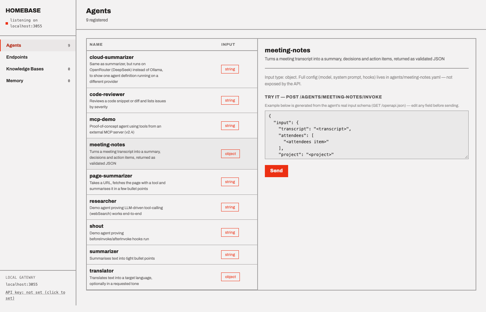
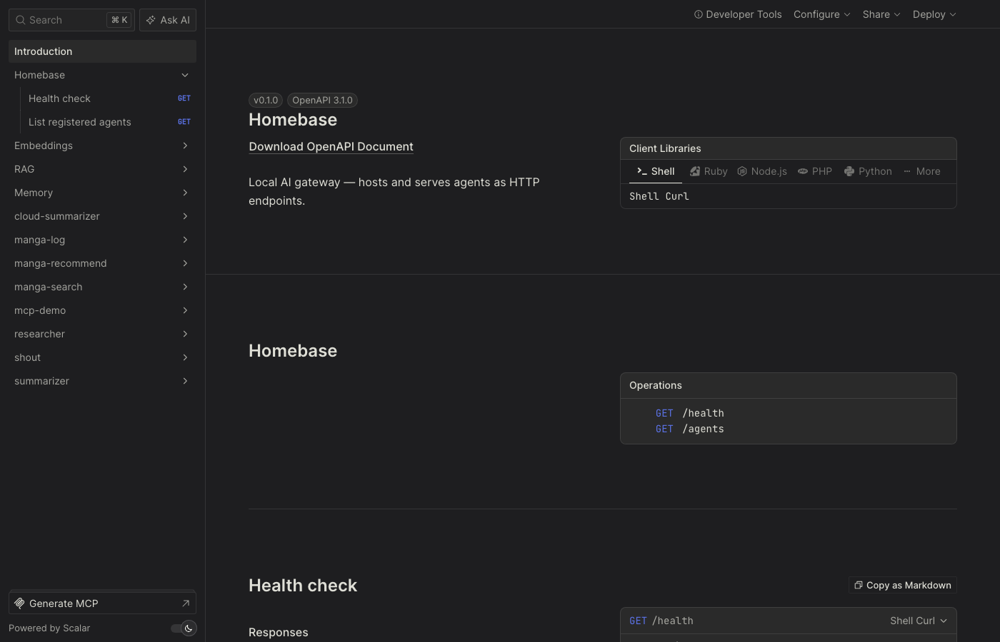
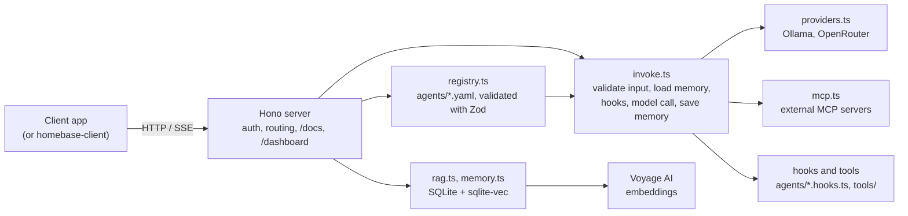

# Homebase

**A local, Bedrock-style platform for defining agents in YAML and running them across multiple models.** Drop a YAML file in `agents/`, get a documented HTTP endpoint for it, with MCP tool support, RAG knowledge bases, conversation memory and optional tool/hook code.

[](https://github.com/waq-b/homebase-ai/actions/workflows/ci.yml)

Screenshots of the running app (real, taken from a local server with no API keys configured):



The API reference at `/docs` is generated automatically. Homebase builds an OpenAPI 3.1 document from the agents it has loaded (input schemas come from the agents' Zod definitions) and renders it with [Scalar](https://scalar.com). Add or edit an agent's YAML and its endpoint appears in the docs with no extra work.



## Why I built it

I wanted one place where my side projects get their AI capabilities, instead of each app wiring up its own model SDK, prompts, retrieval and chat history. Homebase is a small "mini-Bedrock" that runs on my own machine: apps call an HTTP endpoint and never talk to a model provider directly. It was also a way to learn how the pieces of an LLM backend fit together: tool-calling, streaming, RAG, memory and MCP.

## What it does

- **Agents as config.** `agents/<name>.yaml` (provider, model, system prompt, typed input, params) appears at `POST /agents/:name/invoke` and in the generated docs with no restart. The registry re-reads the files on every request.
- **Multiple models.** Agents run on Ollama (Cloud or a local install) or OpenRouter. If an Ollama call fails and `OPENROUTER_API_KEY` is set, a free OpenRouter model takes over.
- **MCP client.** An agent can declare external MCP servers (SSE) and use their tools alongside its own. Connections are opened per request and closed on every path.
- **RAG.** `/kb/*` routes for named knowledge bases: chunking, embedding (Voyage AI), similarity search with metadata filters, and document update/delete. Storage is SQLite plus `sqlite-vec`.
- **Memory.** Pass a `conversationId` and prior turns are replayed from SQLite; `GET`/`DELETE /memory/:id` to inspect or clear.
- **Tools and hooks.** An optional `<name>.hooks.ts` can add `beforeInvoke`/`afterInvoke` steps and AI SDK `tools` the model decides when to call (up to 5 steps).
- **Typed input.** Agents accept `string`, chat `messages`, or a structured `object`. Input is validated with Zod; bad requests get a `400` with details.
- **Streaming** over Server-Sent Events (text deltas, tool calls, tool results).
- **Generated API docs.** An OpenAPI 3.1 document is built from the live agent registry and rendered with Scalar at `/docs`.
- **Dashboard** at `/dashboard`: browse agents, try them, and inspect memory and knowledge bases (vanilla JS, no build step).
- **Optional bearer-token auth** via `HOMEBASE_API_KEY`.

## Architecture



```
src/                core service (server, registry, invoke, providers, rag, memory, mcp, openapi)
agents/             built-in agents: YAML + optional hooks (translator, meeting-notes, code-reviewer, page-summarizer, ...)
tools/              shared AI SDK tools usable from any agent's hooks
examples/manga/     a real app's agents (search, recommend, log) kept as a worked example
mcp-servers/        small standalone MCP server used to demo the MCP client
public/dashboard/   static dashboard (no build step)
homebase-client/    typed client package for apps that call Homebase
toolbar-app/        optional macOS menu-bar controller (Swift)
docs/               per-feature reference
```

## Stack

TypeScript (strict), Node 22.5+, [Hono](https://hono.dev), [Vercel AI SDK](https://sdk.vercel.ai) v4, Zod, `node:sqlite` + `sqlite-vec`, Voyage AI embeddings, Ollama / OpenRouter, `@modelcontextprotocol/sdk`, Vitest, GitHub Actions. Vanilla JS dashboard. Swift/SwiftUI for the optional menu-bar app.

## Run it locally

Requires Node 22.5+ (developed on 24).

```bash
git clone https://github.com/waq-b/homebase-ai.git
cd homebase-ai
npm install
npm run dev          # http://localhost:3000, no .env needed to start
```

With no keys the server starts and you can browse `/dashboard` and `/docs`, list agents, and call the routes that need no model (`/health`, `/agents`, `/openapi.json`, `/memory`). There is no mock-model mode: actually invoking an agent, `/embed` and RAG need real credentials. Copy `.env.example` to `.env` and set:

- `OLLAMA_API_KEY` (Ollama Cloud free tier), or point `OLLAMA_BASE_URL` at a local Ollama install and no key is needed;
- `VOYAGE_API_KEY` for `/embed` and `/kb/*` (embeddings go through Voyage, not Ollama, because Ollama Cloud does not serve embedding models);
- optionally `OPENROUTER_API_KEY` for `provider: openrouter` agents and the automatic fallback.

```bash
curl localhost:3000/health
curl localhost:3000/agents/summarizer/invoke -X POST \
  -H 'content-type: application/json' \
  -d '{"input":"Some text to summarize."}'

# streaming
curl -N "localhost:3000/agents/summarizer/invoke?stream=true" -X POST \
  -H 'content-type: application/json' -d '{"input":"Some text to summarize."}'
```

An agent is just a file:

```yaml
# agents/my-agent.yaml
name: my-agent
description: What this agent does
provider: ollama
model: llama3:latest
system: |
  You are a helpful assistant.
input:
  type: string        # string | messages | object (with a `shape` map)
params:
  temperature: 0.3
hooks: ./my-agent.hooks.ts   # optional
```

## Tests and CI

```bash
npm run typecheck
npm run test:unit
```

`npm run test:unit` is what CI runs: 53 unit tests (config/schema validation, invoke pipeline, registry isolation, RAG chunking and logic, memory, MCP cleanup, agent hooks) that use mocked models and need no network or keys. `homebase-client` has its own typecheck, 7 tests and build, also run in CI.

`*.integration.test.ts` (currently the RAG tests) call the real Voyage embeddings API and need `VOYAGE_API_KEY`. They are **not** run in CI, and `npm test` includes them. Nothing in CI exercises a live model call, so provider behaviour (Ollama, OpenRouter, Voyage) is verified manually only.

## Design decisions

- **Agents are files, and the registry is stateless.** YAML is re-read on every request, so there is no reload step, cache invalidation or admin API. A broken file is skipped and logged without taking down the other agents or the docs. The cost is a small disk read per request, fine for one machine.
- **Tool-calling vs. streaming.** In testing, the Ollama provider's in-stream tool-call detection was unreliable (the tool never fired and the model emitted garbage). Agents with tools therefore generate first and then chunk the result over the same SSE interface, while tool-less agents stream token by token. I chose correctness over a uniform streaming experience; see [docs/invoke.md](docs/invoke.md).
- **MCP connections are per-request.** Simple lifecycle handling and no leaks, at the price of a handshake per call. Pooling is the obvious next step if latency matters. See [docs/mcp.md](docs/mcp.md).
- **One vector table per knowledge base.** Each KB records its embedding model and dimension, so KBs can use different embedding widths. Chunking is intentionally simple (paragraph-aware, fixed size, no overlap). See [docs/rag.md](docs/rag.md).
- **Hand-written Voyage adapter.** The Voyage AI SDK package targeted a newer AI SDK provider interface than the one this project uses, so embeddings go through a small adapter over Voyage's REST API that plugs into `embed`/`embedMany` unchanged. See [docs/embeddings.md](docs/embeddings.md).

## Further reading

[agents](docs/agents.md) · [invoke and streaming](docs/invoke.md) · [tools and hooks](docs/tools-and-hooks.md) · [embeddings](docs/embeddings.md) · [RAG](docs/rag.md) · [memory](docs/memory.md) · [MCP](docs/mcp.md) · [dashboard](docs/dashboard.md) · [remote access](docs/remote-access.md)

## Status

A working personal project built for single-user, single-machine use. Auth is a single shared bearer token; there is no multi-tenancy, rate limiting or request logging. The agents in `agents/` (translator, meeting notes, code reviewer, page summariser, summarisers, an MCP demo) exist to exercise the platform, and `examples/manga/` holds the agents of a real app built on it. The macOS menu-bar app in `toolbar-app/` is macOS-only and not built in CI.

## License

MIT, see [LICENSE](LICENSE).
